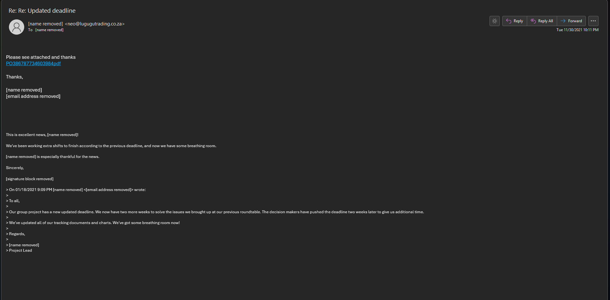
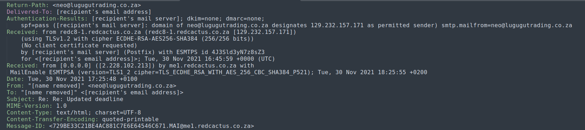
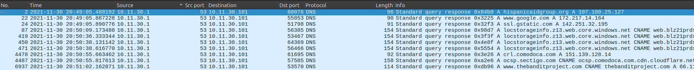
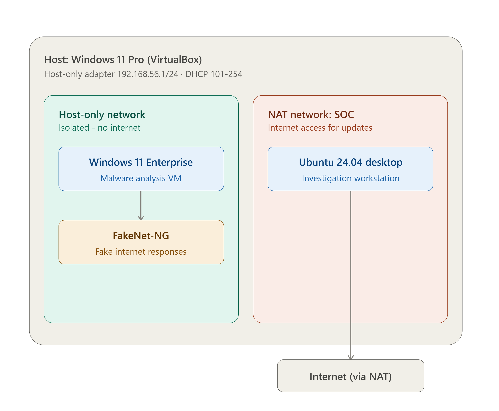

# Emotet Epoch 4 — App Installer Phishing Investigation

> A phishing email abused the Windows `ms-appinstaller` protocol to deliver an Emotet Epoch 4 payload; this project traces the full kill chain from the initial email to C2 communication using email and network forensics.

---

## Summary

A workstation was compromised after a user clicked a link in a phishing email posing as a team lead. The link led to a spoofed Adobe installer page that abused the Windows `ms-appinstaller` protocol to bypass browser security controls, silently downloading and installing a malicious `.appxbundle`. The payload was identified as Emotet, which established C2 communication with Epoch 4 infrastructure, retrieved a secondary payload, and persisted via registry modification.

---

## Scenario

A monitored network workstation was compromised via a malicious spam email that led to an Emotet Epoch 4 infection abusing the Windows App Installer feature. As the analyst on the case, I was provided a full evidence package rather than just a packet capture: the original phishing email (.eml), a full packet capture (.pcap) of the infection traffic, the malicious `.appinstaller` manifest and referenced `.appxbundle`, and a dropped executable with an associated artifact.

- **Environment:** Isolated home lab — separate VirtualBox networks for the "SOC" analysis VM (NAT, internet-connected) and the malware detonation VM (host-only, FakeNet-NG simulated internet)
- **Trigger:** Evidence package tied to a known 2021-11-30 Emotet Epoch 4 infection chain
- **Scope:** Phishing email, single Windows workstation (10.11.30.101), and ~27 minutes of network traffic (10,410 packets)

---

## Goals

What this investigation aimed to determine:

- [x] Identify the initial infection vector and how the App Installer abuse technique manifested in network traffic
- [x] Determine what payload(s) were delivered to the host, and in what order
- [x] Establish whether C2 communication occurred, and with what infrastructure and pattern
- [x] Extract actionable IOCs for blocking and detection going forward

---

## Skills Demonstrated

- Phishing email analysis and header validation (SPF/DKIM/DMARC, Received chain)
- Network traffic analysis and packet-level inspection
- IOC identification, extraction, and enrichment
- Incident timeline and kill-chain reconstruction
- Detection rule writing (Suricata)

---

## Tools Used

| Tool | Purpose |
|---|---|
| Thunderbird | Rendered the malspam email to build context on the social engineering pretext used against the victim |
| Sublime Text | Safely extracted and reviewed email headers and IOCs without risk of detonation |
| VirusTotal | Reputation checks on the extracted domain, IP, and file hashes |
| tcpdump | High-level triage — packet counts and top source/destination IPs to scope the investigation |
| Wireshark | Deep packet inspection, protocol analysis, and artifact/IOC extraction from the pcap |

---

## Technologies & Platforms

- **Operating Systems:** Windows 11 Enterprise (detonation VM), Ubuntu (analysis VM)
- **Network:** Two isolated VirtualBox networks — host-only 192.168.56.0/24 (malware VM, FakeNet-NG simulated internet) and a separate NAT "SOC" segment (analysis VM, real internet access)
- **Logs/Evidence:** Phishing email (.eml), full packet capture (.pcap), malicious `.appinstaller`/`.appxbundle`, dropped executable
- **Platform:** Home lab (VirtualBox)

---

## Project Structure

```
emotet-epoch4-appinstaller/
├── README.md          ← This file — project overview
├── report.md          ← Full investigation report
└── screenshots/
    ├── email.png                  ← Phishing email
    ├── email-validation.png       ← Email headers
    ├── hispanica.png              ← VirusTotal check
    ├── pcap-overview.png          ← PCAP file properties
    ├── dns.png                    ← DNS queries/responses
    ├── query.png                  ← TCP connection to phishing domain
    ├── pdf_host.png                ← Reconstructed PDF download page
    └── lab_diagram.png            ← Lab architecture diagram
```

---

## Key Outcomes

- Initial access was a phishing email impersonating a team lead, linking to a spoofed Adobe installer page that abused the Windows `ms-appinstaller` protocol to bypass browser download protections
- The delivered `.appxbundle` (Emotet) retrieved and executed a secondary payload (`wpprotocol.exe` → `BvZK54PFsCqKio6`) and persisted via registry modification
- C2 communication occurred over HTTPS (port 443) to Epoch 4 infrastructure (46.55.222.11, 66.115.154.34), identified via traffic volume and DNS correlation with the phishing domain
- A working IOC set (domains, IPs, file hashes, registry path) and layered Suricata detection rules were produced for future blocking/detection

---

## Screenshots

**Figure 1.1 — Phishing email as it would appear to the victim, showing the false authority/urgency pretext**



**Figure 1.2 — Email headers (Received, SPF/DKIM/DMARC) used to validate the email as malicious**



**Figure 4.1/4.2 — DNS queries and TCP connection confirming the victim workstation resolved and connected to the phishing domain**



---

## Diagram



> *Diagram: Isolated home lab architecture, showing the host-only detonation network (Windows 11 + FakeNet-NG) kept fully separate from the NAT-connected Ubuntu analysis network, so the self-propagating Emotet payload could be safely detonated and observed.*

---

## Full Report

The complete investigation — including methodology, evidence, findings, and recommendations — is documented in [`report.md`](./report.md).
