# Emotet and Epoch 4 — Investigation Report

**Author:** Dipesh Sapkota
**Date:** 2026-07-30
**Status:** Completed
**Classification:** Lab Exercise — Non-Production Environment

---

## 1. Executive Summary

The Windows workstation was compromised after a user clicked a malicious link embedded in a phishing email. The email employed social engineering techniques by creating a false sense of authority and urgency, persuading the user to follow the provided instructions.

The embedded link redirected the user to a malicious website hosting a fake Adobe installer. When accessed, the website abused the Microsoft **ms-appinstaller** protocol to bypass standard browser security controls, allowing a malicious application to be downloaded and installed directly on the system.

The downloaded file, **iooceenn.appxbundle**, was identified as an Emotet malware payload. Upon execution, the malware established command-and-control (C2) communication with the Epoch 4 infrastructure. Through this connection, a secondary payload was retrieved and executed, resulting in further compromise of the host. Additionally, registry modifications were made to establish persistence, enabling the malware to maintain access across system reboots.

---

## 2. Context

### What Is Being Investigated?

A workstation on a monitored network was compromised via a malicious spam email that led to an Emotet Epoch 4 infection abusing the Windows App Installer feature. As the analyst on this case, I was provided with a full evidence package rather than just a packet capture, consisting of:

1. The original phishing email (.eml) used as the delivery vector
2. A full packet capture (.pcap) of the infection traffic
3. The malicious .appinstaller manifest and the .appxbundle package it referenced
4. A dropped executable (BvZK54PFsCqKio6) and an associated artifact

---

## 3. Goals

This investigation aimed to answer the following questions:

1. What was the initial infection vector, and how did the App Installer abuse technique manifest in the network traffic?
2. What payload(s) were delivered to the host, and in what order?
3. Did the infected host establish command-and-control (C2) communication, and if so, with what infrastructure (IPs/domains) and what pattern (e.g., beaconing intervals)?
4. What indicators of compromise (IOCs) can be extracted from this traffic that would be actionable for blocking or detection going forward?

---

## 4. Environment

### Lab Setup

| Component | Details |
|---|---|
| Role | Investigation lab |
| Hypervisor | Ubuntu VirtualBox |
| Network | Isolated NAT network — 192.168.56.0/24 |
| Internet access | Yes |

| Component | Details |
|---|---|
| Role | Malware lab |
| Hypervisor | Windows 11 Enterprise VirtualBox |
| Network | Host-only — 192.168.56.0/24 |
| Internet access | Simulated (FakeNet-NG) |

### Architecture Diagram


This lab uses VirtualBox to physically and logically separate the "safe" analysis tooling from the live malware detonation environment, which is the core requirement for any malware research setup.

The host (Windows 11 Pro) runs two isolated VirtualBox networks:

- **Host-only network (192.168.56.0/24)** — hosts the Windows 11 VM where Emotet Epoch 4 is actually detonated. This segment has no route to the real internet. Instead, it is paired with FakeNet-NG, which impersonates DNS/HTTP/C2 responses so the malware "thinks" it is online and reveals its network behavior (C2 domains, beacon patterns, dropped payloads) — all of which is captured without ever letting traffic leave the sandbox.
- **NAT network ("SOC")** — hosts the Ubuntu VM used for investigation (log review, IOC lookups, tool updates). This segment does need outbound internet access, so it is kept on a separate NAT'd segment, isolated from the malware VM's network.

Why this separation matters: Emotet is a self-propagating banking trojan/loader — if the analysis VM shared a network with the detonation VM, it could be scanned, infected, or used as a pivot point. Splitting the two networks means the malware is contained even if it tries to spread, while the investigator still has a controlled, internet-connected workspace to research from.

---

## 5. Tools Used

### Tool 1 — Thunderbird

**Why selected:** To get an overview of the malspam email and develop context on what we are dealing with before moving to analytical tools.

**How used:** I used Thunderbird because it provides a structured overview of how the email might look when it arrives in a victim's mailbox, and it allowed me to analyze the social engineering tactics the threat actor used, developing context on how a victim would be persuaded to follow the adversary's next steps.

---

### Tool 2 — Sublime Text

**Why selected:** Sublime Text is a lightweight text editor that helped me identify and extract IOCs safely without risk of detonation.

**How used:** Sublime Text revealed artifacts I would not otherwise have been able to see using only the email client. It helped me locate the email headers, which are essential for validating the authenticity of the email — headers such as Received, Reply-To, Forwarded-To, SPF, DKIM, DMARC, From, To, and several other fields.

---

### Tool 3 — VirusTotal

**Why selected:** VirusTotal is a threat intelligence platform that enables reputation checks on file hashes, malware, domains, and IPs.

**How used:** I used VirusTotal to perform a reputation check on the domain extracted from the email.

---

### Tool 4 — tcpdump

**Why selected:** To get a high-level overview before diving into individual packet-level investigation.

**How used:** My initial use of tcpdump was to get the total packet count and the top source and destination IP addresses, in order to develop the scope of the investigation.

---

### Tool 5 — Wireshark

**Why selected:** To perform deep packet-level inspection and identify the purpose of the communication between the infected host and suspicious entities.

**How used:** I used filters to identify unsecured traffic, construct the context and conversation flow, extract IOCs, and extract artifacts.

---

## 6. Investigation Process

<!-- Document the full workflow in numbered steps. Each step should explain what was done and why. Include screenshot placeholders and evidence references where observations were made. -->

### Step 1 — Initial Triage (Thunderbird, Sublime Text & VirusTotal)

Since the email was the initial attack vector of the investigation, I analyzed the email first. I identified the context the threat actor used to execute the kill chain: creating a false sense of authority by posing as a team lead, prompting the victim to click a malicious link to "update a shift deadline" to fix an unspecified issue.


Figure 1.1: Email that was sent to a victim


Figure 1.2: Email headers

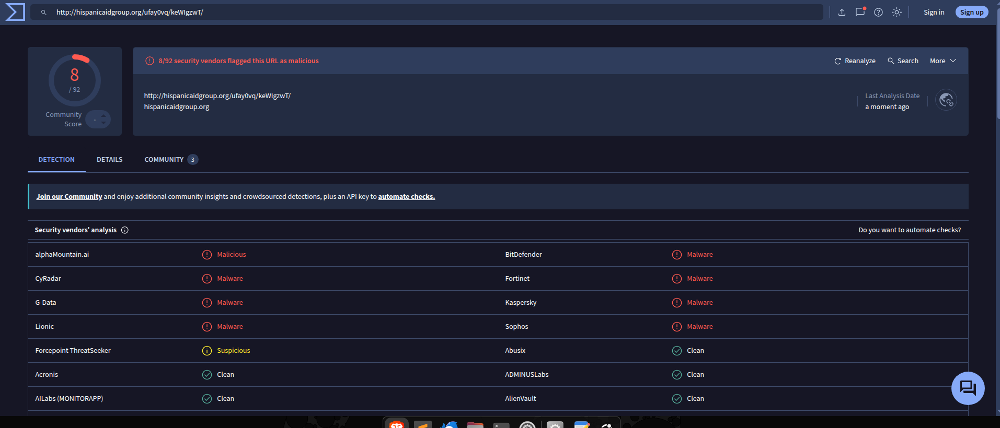
Figure 1.3: VirusTotal check

| Title | Value | Relevance |
|---|---|---|
| Extracted URL | hxxp[://]hispanicaidgroup[.]org/ufay0vq/keWIgzwT/ | Found in email |
| Resolved IP | 107.180.25.127 | Reverse DNS lookup |
| Reputation check (VirusTotal) | 8/92 | Flagged as malicious by security vendors |
| Reception date | Tue, 30 Nov 2021 17:25:48 | Date when victim received email |

**Verdict:** Based on the evidence collected from VirusTotal, the context of the email, and the email security headers shown in Figure 1.2, it is established that this is a phishing email.

---

### Step 2 — Overview of Network Traffic (tcpdump)

After understanding the context and kill chain, I followed the lead from the domain reputation check performed on the domain extracted from the email, which led into network traffic analysis.

Before focusing on a specific domain, I wanted to look at all traffic from a birds-eye perspective to ensure I did not miss any key detail.

Total packets captured during the incident:
```
tcpdump -r  2021-11-30-Emotet-epoch4-infection-from-appinstaller.pcap --count
```
**Total Packets: 10410**

List of top 10 source IP addresses:
```
   tcpdump -tt -r 2021-11-30-Emotet-epoch4-infection-from-appinstaller.pcap -n tcp | cut -d " "-f 3 | cut -d "." -f 1-4 | sort | uniq -c | sort -nr 
```
| Count | IP Address |
|---|---|
| 4671 | 20.150.90.33 |
| 3588 | 10.11.30.101 |
| 1471 | 46.55.222.11 |
| 471 | 66.115.154.34 |
| 122 | 163.172.50.82 |
| 21 | 172.217.14.164 |
| 20 | 142.251.32.195 |
| 14 | 107.180.25.127 |
| 7 | 104.18.30.182 |
| 5 | 151.139.128.14 |

List of top 10 destination IP addresses:
```
tcpdump -tt  -r 2021-11-30-Emotet-epoch4-infection-from-appinstaller.pcap -n tcp | cut -d " " -f 5 | cut -d "." -f 1-4 | sort | uniq -c | sort -nr
```
| Count | IP Address |
|---|---|
| 6802 | 10.11.30.101 |
| 2164 | 20.150.90.33 |
| 1001 | 46.55.222.11 |
| 235 | 66.115.154.34 |
| 129 | 163.172.50.82 |
| 17 | 172.217.14.164 |
| 17 | 142.251.32.195 |
| 12 | 107.180.25.127 |
| 7 | 104.18.30.182 |
| 6 | 151.139.128.14 |

Top source port:
```
tcpdump -tt -r 2021-11-30-Emotet-epoch4-infection-from-appinstaller.pcap -n src 20.150.90.33 and dst 10.11.30.101 | cut -d " " -f 3 | cut -d "." -f 5 | sort | uniq -c | sort -nr
```
| Count | Port |
|---|---|
| 4671 | 443 |

Top destination port:
```
tcpdump -tt -r 2021-11-30-Emotet-epoch4-infection-from-appinstaller.pcap -n src 20.150.90.33 and dst 10.11.30.101 | cut -d " " -f 5 | cut -d "." -f 5 | sort | uniq -c | sort -nr
```
| Count | Port |
|---|---|
| 3675 | 54938 |
| 772 | 54941 |
| 176 | 54930 |
| 19 | 54935 |
| 15 | 54934 |
| 14 | 54937 |

This result shows IP address [10.11.30.101] is using high-numbered ports, while [20.150.90.33] is using port *443* [HTTPS] and generating a high volume of traffic, so I narrowed down the investigation to these two IP addresses.

---

### Step 3 — PCAP Overview (Wireshark)

I captured an overview of the pcap file to correlate the event timeline and get statistics on the captured packets.

**PCAP File Properties reviewed:**

| Title | Value | Relevance |
|---|---|---|
| First packet | 2021-12-01 02:34:04 | Packet capture initiated |
| Last packet | 2021-12-01 03:01:05 | Packet capture ended |
| Elapsed | 00:27:01 | Capture ran for 27 minutes |
| Total packets | 10410 | Total number of packets captured |

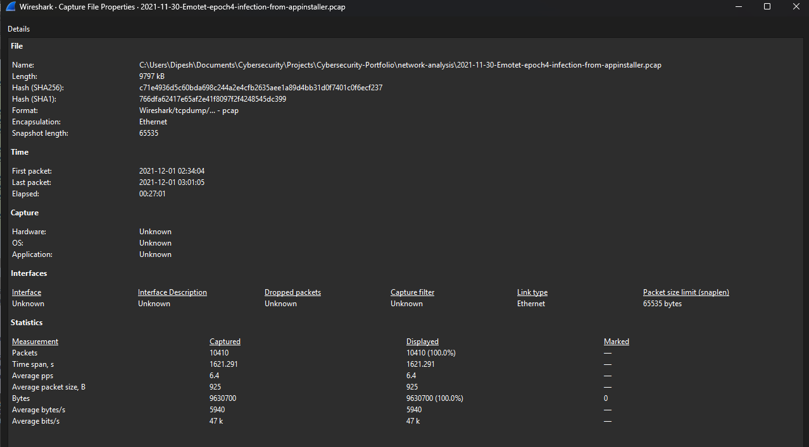
This shows general information about the pcap file I am working with.

---

### Step 4 — Identifying Scope (Wireshark)

To identify the scope of the investigation, I looked at DNS queries and responses.
```
Wireshark filters
dns.flags.response == 1 && dns.flags.rcode == 0
ip.src == 10.11.30.101 && ip.dst == 107.180.25.127
```

Figure 4.1: DNS queries and responses

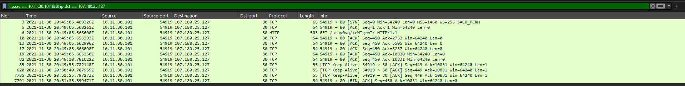
Figure 4.2: TCP connection established between [10.11.30.101] and [107.180.25.127]

From Figures 4.1 and 4.2, it is established that IP [10.11.30.101] is making DNS queries and establishing a TCP connection to [107.180.25.127] on port [80] using the *HTTP* protocol, indicating that IP [10.11.30.101] is the internal victim workstation.

---

### Step 5 — Network Traffic Correlation to Email Link (Wireshark)

Looking at the DNS queries and responses, I found the local host was making DNS queries to the same domain found in the email link. To follow the kill chain, I focused on deeper packet-level inspection of the (hxxp[://]hispanicaidgroup[.]org/ufay0vq/keWIgzwT/) [107.180.25.127] domain. Since this domain used the *HTTP* protocol, I was able to extract the application data and reconstruct the original website that was hosting the App Installer link.

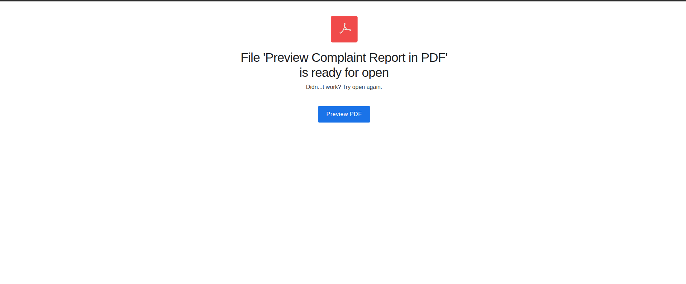
Figure 5.1: PDF download page

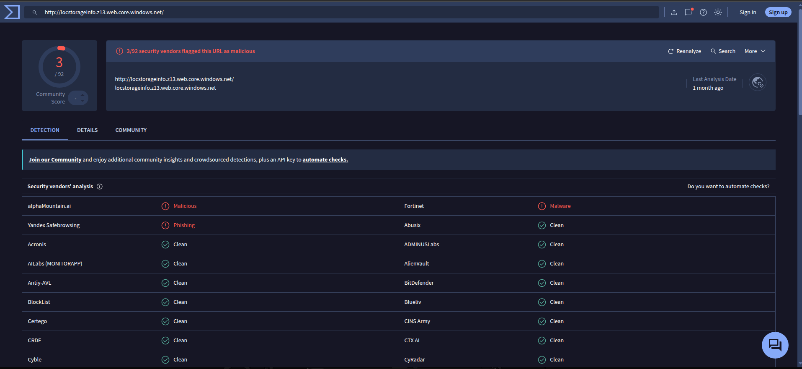
Figure 5.2: VirusTotal check for hxxps[://]locstorageinfo[.]z13[.]web[.]core[.]windows[.]net

| Title | Value | Relevance |
|---|---|---|
| Extracted URL | ms-appinstaller:?source=hxxps[://]locstorageinfo[.]z13[.]web[.]core[.]windows[.]net/ioocceneen[.]appinstaller | Found in PDF download |
| Resolved IP | 20.150.90.33 | Reverse DNS lookup |
| Reputation check (VirusTotal) | 3/92 | Flagged as malicious by security vendors |

---

### Step 6 — Follow-up in Wireshark

After extracting the URL from the PDF download page, I searched for queries and requests made to that URL. I found communication between the local host and IP [20.150.90.33] on port [443] [HTTPS], which also falls under the top source and second-highest destination IP addresses. This is the IP that was queried immediately after the initial DNS request for the PDF download page, which fits precisely into the kill chain timeline.

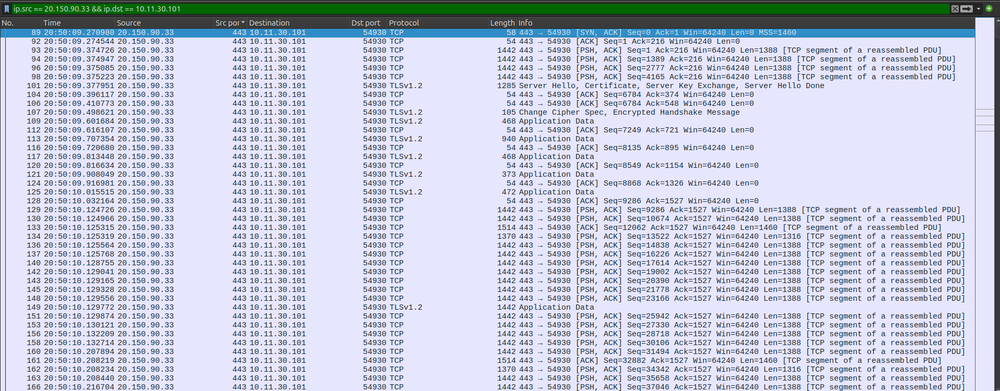
Figure 6.1: TCP connection between local host and [20.150.90.33]

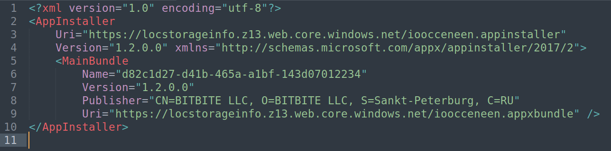
Figure 6.2: Source code of ms-appinstaller file ioocceneen.appinstaller

| Title | Value | Relevance |
|---|---|---|
| File name | ioocceneen.appinstaller | Investigation file |
| Extracted URL | hxxps[://]locstorageinfo[.]z13[.]web[.]core[.]windows[.]net/ioocceneen[.]appxbundle | Found in ioocceneen.appinstaller source code |
| Resolved IP | 20.150.90.33 | Reverse DNS lookup |
| Reputation check (VirusTotal) | 3/92 | Flagged as malicious by security vendors |

From the [PSH, SYN] flags seen in Figure 6.1, it is confirmed that a large volume of application data was downloaded. Since the local host made an [HTTPS] request to [20.150.90.33], we are limited to inspecting TCP metadata only, but we do have the ioocceneen.appinstaller file as the investigation artifact.

---

### Step 7 — Malware Analysis (Static and Dynamic)

I followed the URL hxxps[://]locstorageinfo[.]z13[.]web[.]core[.]windows[.]net/ioocceneen[.]appxbundle, and based on the network traffic, it is confirmed that the application was downloaded. I performed basic static and dynamic malware analysis on the downloaded [ioocceneen.appxbundle] to identify the activity of the files.

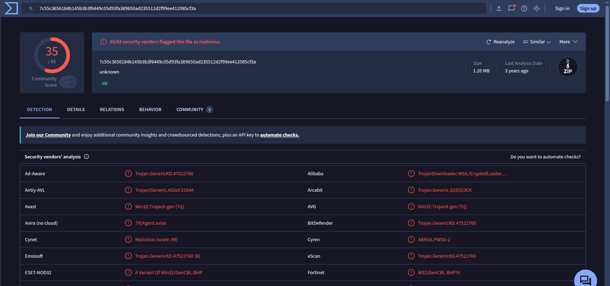
Figure 7.1: File reputation — ioocceneen.appxbundle

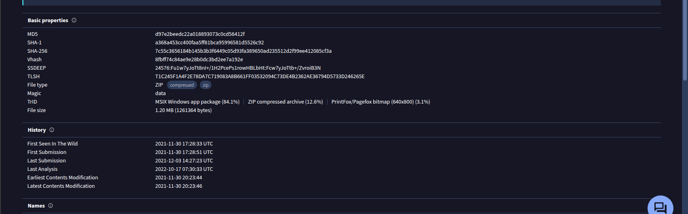
Figure 7.2: File reputation — ioocceneen.appxbundle

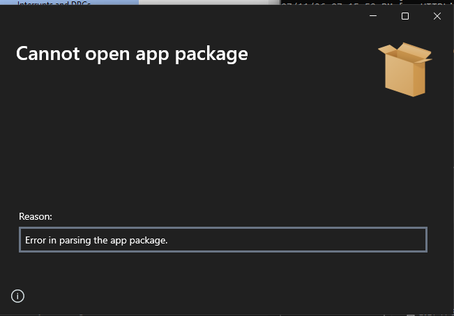
Figure 7.3: App Installer execution

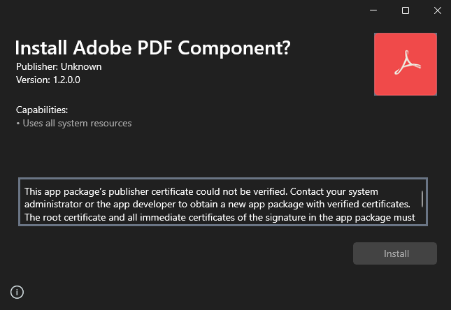
Figure 7.4: ioocceneen.appxbundle execution

| Title | Value | Relevance |
|---|---|---|
| File name | ioocceneen.appxbundle | Trojan Dropper Zip |
| MD5 | D97E2BEEDC22A018893073C0CD56412F | File hash |
| SHA1 | A368A453CC400FAA5FF81BCA95996581D5526C92 | File hash |
| SHA256 | 7C55C3656184B145B3B3F6449C05D93FA389650AD235512D2F99EE412085CF3A | File hash |
| File location | hxxps[://]locstorageinfo[.]z13[.]web[.]core[.]windows[.]net/ioocceneen[.]appxbundle | File source |
| Reputation check (VirusTotal) | 35/63 | Flagged as malicious by security vendors |

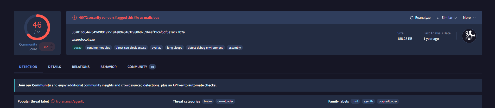
Figure 7.5: wpsprotocol.exe

| Title | Value | Relevance |
|---|---|---|
| File name | wpprotocol.exe | Trojan Downloader exe |
| MD5 | 00b9c88bd2d69ecbc73787fb1addf981 | File hash |
| SHA1 | dd052c34115758f4c3e235243e2015495d3473a5 | File hash |
| SHA256 | 36a81cd64e7649d9f91925194e89e8463c980682596eef19c4f5df6e1ac77b2a | File hash |
| File in ioocceneen.appxbundle | ioocceneen.appxbundle/Adobe_1.2.0.0_x86/CustomParts/wsprotocol.exe | Source of exe |
| Reputation check (VirusTotal) | 46/72 | Flagged as malicious by security vendors |

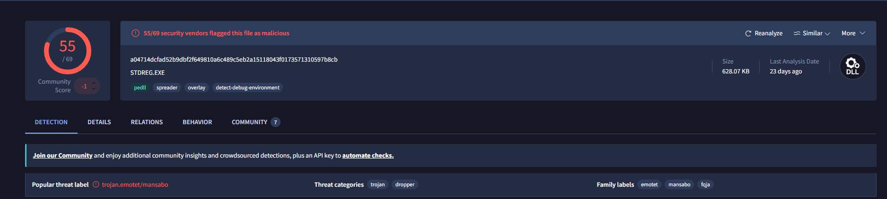
Figure 7.6: Emotet DLL

| Title | Value | Relevance |
|---|---|---|
| File names | BvZK54PFsCqKio6, STDREG.EXE, 4bpWddqv.dll | Trojan Emotet DLL |
| MD5 | 9e762105e31c89138b29276916930ffb | File hash |
| SHA1 | 8d8a38adace0cad00a56e510c554769ab4bd296d | File hash |
| SHA256 | a04714dcfad52b9dbf2f649810a6c489c5eb2a15118043f0173571310597b8cb | File hash |
| File location | hxxp[://]www[.]thebanditproject[.]com/wp-content/BvZK54PFsCqKio6/ | Source of exe |
| Reputation check (VirusTotal) | 55/69 | Flagged as malicious by security vendors |

Upon execution of ioocceneen.appxbundle, the self-signed Adobe certificate caused the app to fail certificate verification, so it was unable to download wpprotocol.exe — however, we have the file for this investigation. Per the timestamp, the last DNS query was made to hxxp[://]www[.]thebanditproject[.]com/wp-content/BvZK54PFsCqKio6 using [HTTP] on port [80], and I was able to follow the HTTP stream to extract the DLL file from it. Upon investigation, this was confirmed to be the Emotet trojan, as shown in Figure 7.6.

---

### Step 8 — Timeline Reconstruction

[Describe how the timeline was assembled from available evidence.]

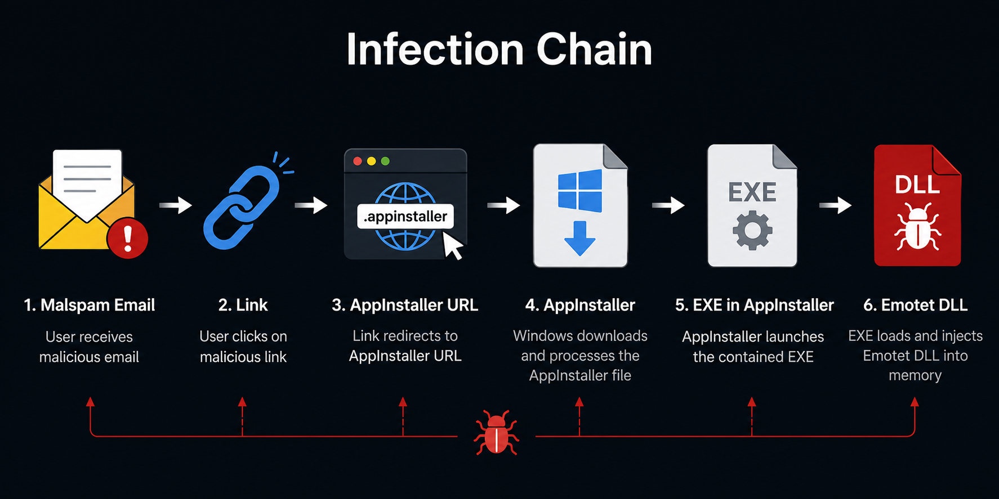
Figure 8.1: Infection chain

**Attack Timeline**

| Timestamp | Event | Source |
|---|---|---|
| 2021-11-30 17:25:48 | Email received | Email sample |
| 2021-11-30 20:49:04 | Link clicked | Email sample |
| 2021-11-30 20:50:09 | Link clicked | PDF site |
| 2021-11-30 20:50:36 | ms-appinstaller invoked | Pcap file |
| 2021-11-30 20:50:38 | Appxbundle downloaded | Pcap file |
| 2021-11-30 20:51:03 | Emotet download | Pcap file |
| 2021-11-30 20:51:10 | C2 traffic observed | Pcap file |
| 2021-11-30 20:59:00 | Registry update | Registry log |

---

## 7. Findings

From the infection chain, it is confirmed that the local host machine was infected with a trojan established for command-and-control threat execution.

### What Was Discovered

1. The email is confirmed to be a malspam email because it fails security checks, lacks authenticity, and uses social engineering tactics.
2. A URL extracted from the email leads to an ms-appinstaller download page.
3. A malicious file named ioocceneen.appxbundle was downloaded, abusing the Microsoft ms-appinstaller protocol.
4. A trojan named wpprotocol.exe was downloaded via the file ioocceneen.appxbundle, bypassing browser-level security.
5. An Emotet DLL file was downloaded via wpprotocol.exe, impersonating an Adobe installer.
6. After installation of the trojan, a pattern of C2 beaconing was observed.

### Evidence

**Initial Access**

Initial access was via a phishing email. Evidence collected from email header analysis suggested the email is phishing. A link found in the email was confirmed to be malicious.

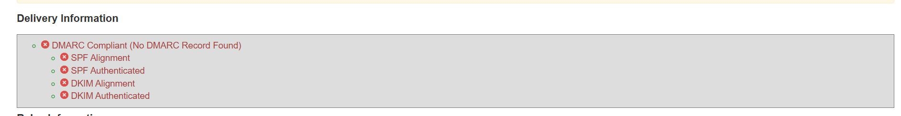
*Figure: Email validation failed*

---

**Persistence**

After completing network traffic analysis of the pcap file, registry changes were found to have been made.

```
Key Name:          HKEY_CURRENT_USER\SOFTWARE\Microsoft\Windows\CurrentVersion\Run
Class Name:        <NO CLASS>
Last Write Time:   11/30/2021 - 8:59 PM
Value 0
  Name:            bhryuac.wmn
  Type:            REG_SZ
  Data:            C:\WINDOWS\SysWOW64\rundll32.exe "C:\Users\[username]\AppData\Local\Pvglfpllzel\bhryuac.wmn",drdzIUvLF
```

---

**Command and Control**

When I followed up on the next top IP addresses, I found patterns of C2 communication with [46.55.222.11] and [163.172.50.82].
```
Wireshark filter

ip.addr == 46.55.222.11
ip.addr == 163.172.50.82
```

| IOC Type | Value | Source | Confidence |
|---|---|---|---|
| IP Address | [46.55.222.11] | Wireshark | High |
| IP Address | [163.172.50.82] | Wireshark | High |
| Ports | 443 | Wireshark | High |
| Protocols | HTTPS | Wireshark | High |
| Beacon intervals | 1 sec | Wireshark | High |
| Data volumes | 1514, 54, 1430 | Wireshark | High |
| File Hash Emotet (MD5) | 9e762105e31c89138b29276916930ffb | VirusTotal | High |

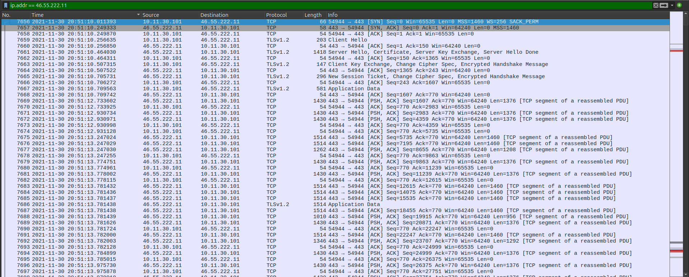
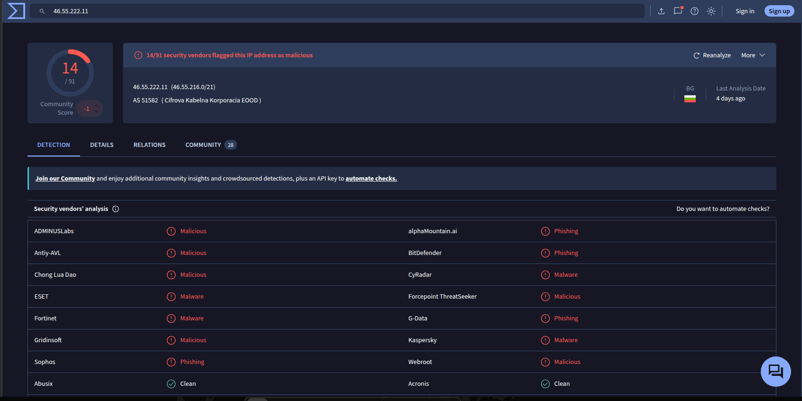
Figure: C2 traffic and its infrastructure [46.55.222.11]

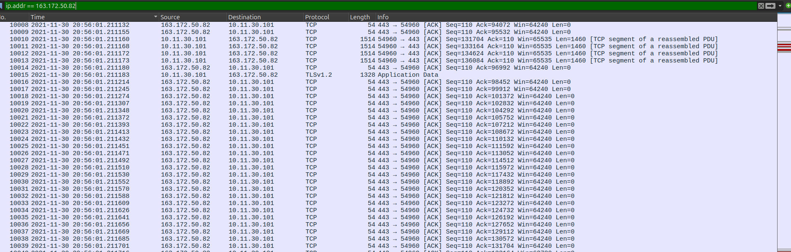
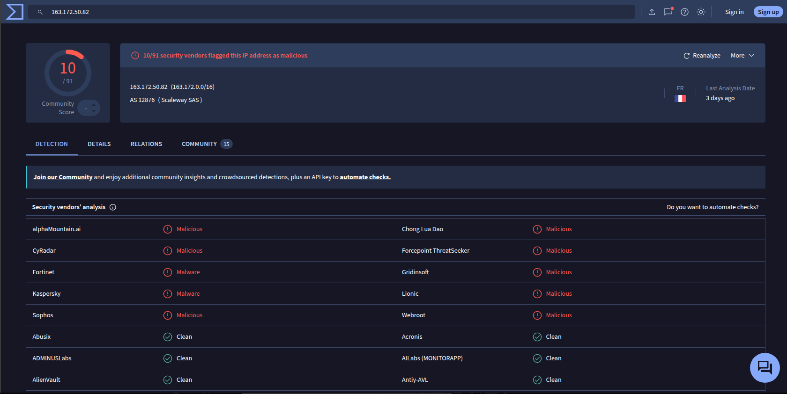
Figure: C2 traffic and its infrastructure [163.172.50.82]

---

### MITRE ATT&CK Mapping

| Tactic | Technique | ID | Observed |
|---|---|---|---|
| Initial Access | Phishing: Spearphishing Link | T1566.002 | Malicious email impersonating team lead with embedded link |
| Execution | User Execution: Malicious Link | T1204.001 | User clicked link leading to fake PDF page |
| Defense Evasion | System Binary Proxy Execution | T1218 | ms-appinstaller protocol invoked to bypass browser download warnings |
| Defense Evasion | Subvert Trust Controls: Mark-of-the-Web Bypass | T1553.005 | App Installer fetches payload outside browser, bypassing MotW tagging |
| Defense Evasion | Masquerading | T1036 | Package presented as "Adobe PDF Component" with fake branding |
| Command and Control | Ingress Tool Transfer | T1105 | .appinstaller → .appxbundle → Emotet DLL fetched from external servers |
| Command and Control | Application Layer Protocol: Web Protocols | T1071.001 | C2 traffic observed over HTTP/HTTPS post-infection |
| Command and Control | Encrypted Channel | T1573 | C2 communications encrypted, payload not inspectable from pcap alone |
| Persistence | Modify Registry | T1112 | Registry update log confirms changes made post-execution |

---

## 8. Recommendations

<!-- Explain what should be done, why, and what it would prevent. Avoid vague suggestions. -->

### Detection Opportunities

1. **Detection Recommendation 1**
   - *What to detect:* Suspicious external email.
   - *How:* Use an email gateway to filter or mark external mail.
   - *Prevents:* This will prevent initial access via malicious emails.

2. **Detection Recommendation 2**
   - *What to detect:* `.exe`, `.dll`, or `Content-Type: application/x-msdownload` in HTTP GET responses.
   - *How:* IDS/IPS tools such as Suricata can be used to block malicious artifacts. Below are rules to block artifacts based on this investigation.

#### Suricata Rules — Block Windows Executable Downloads over HTTP

These rules block incoming HTTP responses containing Windows executable files (EXE/DLL) destined for internal hosts.

##### Assumptions

```suricata
var HOME_NET [192.168.0.0/16,10.0.0.0/8,172.16.0.0/12]
var EXTERNAL_NET any
```

##### 1. Block Content-Type: application/x-msdownload

```suricata
drop http $EXTERNAL_NET any -> $HOME_NET any (
    msg:"POLICY Block application/x-msdownload";
    flow:established,to_client;
    http.header;
    content:"Content-Type|3a| application/x-msdownload"; nocase;
    classtype:policy-violation;
    sid:1000001;
    rev:1;
)
```

##### 2. Block PE Executables (MZ Signature)

```suricata
drop http $EXTERNAL_NET any -> $HOME_NET any (
    msg:"POLICY Block PE executable (MZ)";
    flow:established,to_client;
    file.data;
    content:"MZ";
    depth:2;
    classtype:policy-violation;
    sid:1000002;
    rev:1;
)
```

##### 3. Block PE32 Executables using File Magic

```suricata
drop http $EXTERNAL_NET any -> $HOME_NET any (
    msg:"POLICY Block PE32 executable";
    flow:established,to_client;
    filemagic:"PE32 executable";
    classtype:policy-violation;
    sid:1000003;
    rev:1;
)
```

##### 4. Block DLL Files

```suricata
drop http $EXTERNAL_NET any -> $HOME_NET any (
    msg:"POLICY Block DLL download";
    flow:established,to_client;
    filemagic:"DLL";
    classtype:policy-violation;
    sid:1000004;
    rev:1;
)
```

##### 5. Block .exe Filename in HTTP Headers

```suricata
drop http $EXTERNAL_NET any -> $HOME_NET any (
    msg:"POLICY Block EXE filename";
    flow:established,to_client;
    http.header;
    pcre:"/filename\s*=\s*\"?.*\.exe\"?/i";
    classtype:policy-violation;
    sid:1000005;
    rev:1;
)
```

##### 6. Block .dll Filename in HTTP Headers

```suricata
drop http $EXTERNAL_NET any -> $HOME_NET any (
    msg:"POLICY Block DLL filename";
    flow:established,to_client;
    http.header;
    pcre:"/filename\s*=\s*\"?.*\.dll\"?/i";
    classtype:policy-violation;
    sid:1000006;
    rev:1;
)
```

##### Optional — Block Incoming HTTP Requests to Internal Web Servers

If you want to block **incoming HTTP traffic** from the Internet to internal web servers:

```suricata
drop http $EXTERNAL_NET any -> $HOME_NET 80 (
    msg:"POLICY Block inbound HTTP";
    flow:to_server,established;
    sid:1000010;
    rev:1;
)
```

Or block HTTP to any destination port:

```suricata
drop tcp $EXTERNAL_NET any -> $HOME_NET 80 (
    msg:"POLICY Block inbound HTTP TCP";
    flow:to_server,established;
    sid:1000011;
    rev:1;
)
```

If your internal web server uses multiple ports:

```suricata
drop http $EXTERNAL_NET any -> $HOME_NET any (
    msg:"POLICY Block all inbound HTTP";
    flow:to_server,established;
    sid:1000012;
    rev:1;
)
```

##### Recommended Production Rules

Deploy the following rules together:

- SID 1000001 – Block `application/x-msdownload`
- SID 1000002 – Block `MZ` file signature
- SID 1000003 – Block `PE32 executable`
- SID 1000004 – Block `DLL`
- SID 1000005 – Block `.exe` filename
- SID 1000006 – Block `.dll` filename

These rules provide layered detection against Windows executable downloads over HTTP.

##### Requirements

Suricata must be running in **IPS mode** (NFQUEUE, AF_PACKET IPS, or inline mode). Using `drop` rules in IDS mode will only generate alerts and will not block traffic.

Enable HTTP file inspection in `suricata.yaml`:

```yaml
app-layer:
  protocols:
    http:
      enabled: yes

file-store:
  enabled: yes

outputs:
  eve-log:
    types:
      - files
```

For `filemagic` rules (SID 1000003 and 1000004), ensure your Suricata build includes **libmagic** support.

### Hardening Suggestions

1. Use an email gateway to block or flag unknown domains, keywords, and file extensions. An email gateway will prevent potentially malicious emails from reaching a victim's mailbox.
2. Perform vulnerability assessments regularly and patch any findings — an unknown, unpatched vulnerability can have a high impact on business operations.
3. Install EDR and antivirus on every workstation to monitor, detect, and prevent threats capable of causing critical damage.
4. Train and raise awareness among employees. Humans remain highly exploitable, and even top-tier security controls can be undermined by a single human vulnerability with critical-level impact.

### Future Work

- [ ] Follow-on investigation or improvement — Set up a detection rule in Suricata for C2 beacon behavior
- [ ] Lab enhancement — Add EDR capability to improve process-level visibility
- [ ] Skill area to develop — Practice memory forensics for this scenario using Volatility

---

## 9. Lessons Learned

### What Went Well

tcpdump, along with Wireshark, helped me map most of the infection kill chain and produced clear results. Reviewing DNS queries and correlating them with the attack timeline confirmed my hypothesis.

### What Was Difficult

This investigation was not limited to pcap analysis, and it took longer than expected for the following reasons:

1. This was my first real-world incident investigation, so I had to map the full attack chain and learn multiple tools and methods along the way.
2. I could not see through encrypted traffic. Even though I had suspicions about certain traffic, I could not prove it directly from my machine.
3. This incident occurred five years ago, so all of the original infrastructure had been shut down, and I could not pull evidence from live servers.
4. This incident spans multiple platforms to investigate — email, workstation, and network — and I was limited by the resources available to me; I did not have access to the Windows log files.

### Mistakes Made

I initially tried to extract every artifact from the pcap and kept hitting a wall, so I tried to find shortcuts by randomly searching for unencrypted traffic. This did not relate to my ongoing investigation, so I had to restart my approach from the beginning. I also performed dynamic malware analysis but it was unsuccessful, since much of the supporting infrastructure has since been patched or taken down, so the results did not match what I expected.

### What I Would Do Differently

Next time, I would like to change my process by staying focused on the investigation goals rather than investing too much time on process steps that are less relevant to the investigation's objectives. I would also like to build my own tools to automate repetitive tasks, such as domain reputation and static file reputation checks.

### Skills Gained

- Mapping out the attack chain and correlating events from different sources
- Pattern recognition
- Network traffic analysis
- Documentation
- MITRE ATT&CK framework
- Virtualization and tooling

---

## 10. References

1. MITRE ATT&CK®. *Enterprise Matrix.* The MITRE Corporation. Available at: [https://attack.mitre.org/](https://attack.mitre.org/)
2. VirusTotal. *File, URL, Domain, and IP Reputation Analysis Platform.* Google. Available at: [https://www.virustotal.com/](https://www.virustotal.com/)
3. Wireshark Foundation. *Wireshark Network Protocol Analyzer.* Available at: [https://www.wireshark.org/](https://www.wireshark.org/)
4. The Tcpdump Group. *tcpdump & libpcap.* Available at: [https://www.tcpdump.org/](https://www.tcpdump.org/)
5. Mandiant / FLARE. *FakeNet-NG — Next Generation Dynamic Network Analysis Tool.* Available at: [https://github.com/mandiant/flare-fakenet-ng](https://github.com/mandiant/flare-fakenet-ng)
6. Open Information Security Foundation (OISF). *Suricata — Network IDS, IPS, and NSM Engine.* Available at: [https://suricata.io/](https://suricata.io/)
7. Mozilla. *Thunderbird Email Client.* Available at: [https://www.thunderbird.net/](https://www.thunderbird.net/)
8. Sublime HQ. *Sublime Text — Text Editor.* Available at: [https://www.sublimetext.com/](https://www.sublimetext.com/)
9. 2021-11-30-Emotet-epoch4-infection-from-appinstaller.pcap — packet capture evidence file (internal case evidence).

---

## 11. Appendix

### A. IOC Table

| Type | Value | Source | Notes |
|---|---|---|---|
| IP | [107.180.25.127] | [Email] | [Follow up link] |
| IP | [20.150.90.33] | [PDF website] | [link For appinstaller] |
| Domain | [hxxp[://]hispanicaidgroup[.]org] | [Email] | [Follow up link] |
| Domain |[hxxps[://]locstorageinfo[.]z13[.]web[.]core[.]windows[.]net] | [PDF Website] | - |
| MD5 | [D97E2BEEDC22A018893073C0CD56412F] | [ioocceneen.appinstaller] | [ioocceneen.appxbundle] |
| MD5 | [00b9c88bd2d69ecbc73787fb1addf981] | [ioocceneen.appxbundle] | [wpprotocol.exe] |
| MD5 | [9e762105e31c89138b29276916930ffb] | [wpprotocol] | [BvZK54PFsCqKio6] emotet |
| IP | [46.55.222.11] | [PCAP] | [C2 traffic] |
| IP | [66.115.154.34] | [PCAP] | [C2 traffic] |

| File Path | [\AppData\Local\Pvglfpllzel\bhryuac.wmn",drdzIUvLF] | [Registry log] |[BvZK54PFsCqKio6]  |


---

*This report documents a real incident investigation conducted in an isolated lab environment for educational purposes. All IPs, hostnames, and indicators are real .*

---

